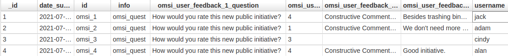

citiesQuest
==============

CitiesQuest is an objective, efficient, and usable CKAN extension to allow users to create and fill questionnaires and manage the gathered data.
Since CKAN provides the necessary tools and functionalities for the easy and correct management of data (open or not), implementing this extension will provide a new way of gathering information.
It can be used for any scenario, although the main focus was the people's feedback. 

*Note: Check the wiki for more detailed information*

Installation
--------
- To install ckanext-citiesQuest in a set of Docker images and configuration files to run a CKAN site (https://github.com/okfn/docker-ckan):

     1. Go to Dockerfile in ckan folder ``/ckan/Dockerfile`` and add:

          RUN pip install -e git+https://gitlab.ubiwhere.com/smart-cities-h2020/tenderhealth/ckan-custom-forms.git@master#egg=ckanext-citiesQuest

     2. Add the plugin ``citiesQuest`` to the ``ckan.plugins`` setting in your CKAN config file

     3. Rerun or Restart CKAN container::

          docker container start/restart <name_of_ckan_container>

- To install ckanext-citiesQuest on local CKAN project:

     1. Activate your CKAN virtual environment, for example::

          . /usr/lib/ckan/default/bin/activate

     2. Install the ckanext-citiesQuest Python package into your virtual environment::

          pip install ckanext-citiesQuest

     3. Add ``citiesQuest`` to the ``ckan.plugins`` setting in your CKAN config file (by default the config file is located at ``/etc/ckan/default/production.ini``).

     4. Restart CKAN. For example if you've deployed CKAN with Apache on Ubuntu::

          sudo service apache2 reload

--------------------
Create Questionnaire
--------------------

The data from the JSON files that are uploaded to CKAN for questionnaire rendering is generated 
in an external website. To facilitate the perception and understanding of this process, 
it will be explain, step by step, what must be done.

**SurveyJS** is an online visual survey creator and form builder that offers exactly what we want.

This is a critical part of the process. 
he structure used in the website is what the extension will try to understand to be able to render 
it in an efficient and organized way. So, we define a default structure, where some pages and corresponding 
properties are mandatory to avoid malformed questionnaires.

1. Go to https://surveyjs.io/Examples/Survey-Creator#content-result and, using the survey design, you can start creating the questionnaire.

2. Change the page properties to create an introduction page (title, name, description).

3. Create the right components on the introduction page (*Component* objects).

4. Add new pages to fill them with questions.

5. All the questions must be inside a *Panel* object. After inserting one or several *Panels*, there are four types of inputs that our extension accepts:

     * radio group: To add it to the questionnaire, simply choose the tool ‘RadioGroup’ and click or drag it into the panel. It is possible to change the order of the questions by dragging them up and down. Having the object in the survey design and inside a panel, click on it and go to the ‘Properties’ link. There, you can define a question's default fields (here the ‘Description’ field is ignored) and then it can be defined if it is required or not. By activating the field ‘Is required’, the extension will assume the obligation and the user will have to answer it. Having the question's text, it's needed to configure the possible answers. For that, go to the ‘Choices’ option (a dropdown button in the ‘Properties’ area). It contains the default key/values generated by the website and those are the fields that must be changed. It is possible to erase, add options and change their values. For a correct definition of each option, the following steps must be followed:

          * change the ‘Text’ input to the value that will appear in the question as possible options;
          
          * change the ‘Value’ input with a snake case style (p.e not_at_all ). Basically, it is the same as the ‘Text’ input but converted into a snake case.

     * single input: It is the classic type of question where the user needs to write his own answer. To add it, choose the tool ‘Single input’ (it is also possible to order it). The rules are the same as for the radio group questions but in this case, there are no choices and it is possible to write a placeholder.

     * Geolocation: To be able to provide a better experience and interaction with the platform, this input type renders a map where the user can search for a specific address and choose it for the incident's place. The options available for each search are the available ones with the key used;

     * Annexes (images): This input type provides the possibility of uploading images. It can be fixed on one or unlimited. The images are only uploaded in the end, which gives the option to delete the chosen ones and add different ones.

6. Finishing the questionnaire pages and having prepared the introduction page as well, the questionnaire is complete. Now, it's needed to access the raw data and then export it. For that, SurveyJS provides a JSON Editor. It is a tab that enables the visualization of questionnaire raw data and provides the information in JSON format. To be able to export this data, this tab has several buttons with different actions. By clicking on the ‘Copy’ button, all the data is copied.

7. Once all the necessary data has been copied from the JSON Editor, the next step is to save it in a local file. To do it, use a text editor. Open a new file,  paste all the data and then save it as a JSON file. The file must be saved in JSON format (p.e trash_bins.json).

8. Create a new resource in a templating dataset and upload the JSON file to CKAN.

9. In CKAN, an example JSON file is provided that contains SurveyJS generated data and that can be imported into the website and then changed to the creators’ requirements.

----------
Examples
----------

The following examples are two questionnaires that were already tested and collect crucial data regarding public initiatives and the incident's report.

### Public Initiative
[Public Initiative Json](ckanext/citiesQuest/public/OMSI_user_report_incident.json)

In this example, it's provided a form only with two questions regarding the user's opinion about the initiative, briefly explained on the initial page and at the beginning of the form, and an open text for the user to write what he desires. Important to mention that the first one is mandatory and the second isn't.

After some responses, its visualization in CKAN is the following:

____
### Incident Report
[Incident Report Json](ckanext/citiesQuest/public/OMSI_user_report_incident.json)

To collect crucial data from this report, all the available question's types are used:
  * Choose the exact place where the incident occurs using a dynamic map; 
  * Description, year, and open comments through single input questions;
  * Annexes using file input;

It contains both mandatory questions and not, and input verification.

After some responses, its visualization in CKAN is the following:

_Note: All the responses can be exported in several formats (JSON, CSV, TSV, and XML)_

---------------
Important rules
---------------

The following points are the rules and features that need to be followed for our extension to work efficiently:
* To create an organisation, you need to be a registered user;

* Only admin and editors’ users  can create new datasets and resources;

* If a templating dataset is public, users from all organisations and non-registered users can visualise it and answer it as well;

* If a templating dataset is private, only members from that organisation can have access to the questionnaires in the dataset. It is possible to add specific members as well by writing  the username on the ‘Add Member’ page;

* Datasets that store questionnaires’ responses (is_data_store) are automatically created;

* Questionnaires that do not respect the default rules will return error messages to the final user. In that case, export the JSON data to SurveyJS and review it;

* If a user does not answer all the required questions, an alert will be displayed;

---------------
Requirements
---------------

This extension was tested and can be executed for version 2.8 of CKAN. Any other
version wasn't tested so its not completly safe to use it in others versions.

---------------
Development Installation
---------------

To install ckanext-citiesQuest for development, activate your CKAN virtualenv and
do::

    git clone https://github.com/urbanplatform/ckan-custom-forms.git
    cd ckanext-citiesQuest
    python setup.py develop
    pip install -r dev-requirements.txt
