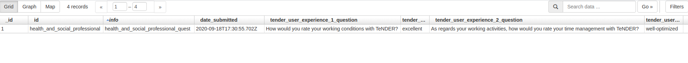
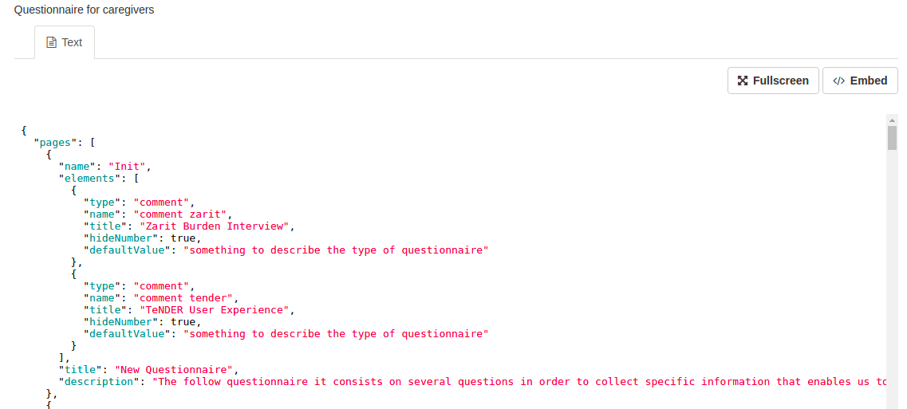
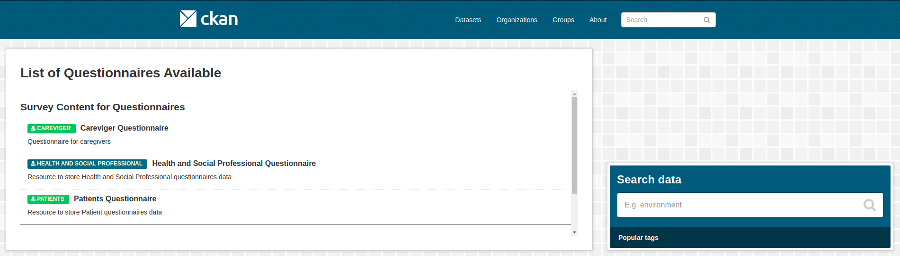

.. .. You should enable this project on travis-ci.org and coveralls.io to make
..    these badges work. The necessary Travis and Coverage config files have been
..    generated for you.

.. ..  image:: https://travis-ci.org/lsantos/ckanext-ext_v1.svg?branch=master
.. ..    :target: https://travis-ci.org/lsantos/ckanext-ext_v1

.. ..  image:: https://coveralls.io/repos/lsantos/ckanext-ext_v1/badge.svg
.. ..  :target: https://coveralls.io/r/lsantos/ckanext-ext_v1

.. ..  image:: https://pypip.in/download/ckanext-ext_v1/badge.svg
.. ..  :target: https://pypi.python.org/pypi//ckanext-ext_v1/
.. ..  :alt: Downloads

.. ..  image:: https://pypip.in/version/ckanext-ext_v1/badge.svg
.. ..  :target: https://pypi.python.org/pypi/ckanext-ext_v1/
.. ..  :alt: Latest Version

.. ..  image:: https://pypip.in/py_versions/ckanext-ext_v1/badge.svg
.. ..    :target: https://pypi.python.org/pypi/ckanext-ext_v1/
.. ..    :alt: Supported Python versions

.. ..  image:: https://pypip.in/status/ckanext-ext_v1/badge.svg
.. ..    :target: https://pypi.python.org/pypi/ckanext-ext_v1/
.. ..    :alt: Development Status

.. ..  image:: https://pypip.in/license/ckanext-ext_v1/badge.svg
.. ..    :target: https://pypi.python.org/pypi/ckanext-ext_v1/
.. ..    :alt: License

==============
ckanext-ext_v1
==============

Ext_v1 is a CKAN extension that allow users to create and fill multiple questionnaires.

Since CKAN makes it possible to create organizations, this allows the responsible users for a 
given institution to provide / collect information in a secure manner.
One of the many ways to present information in order to be able to evaluate it 
and collect more concise and specific results is by filling out questionnaires.

Therefore, ext_v1 is a first version of what we called **questionnaire-gen**.

In short, using extras pair of key/values in the creation of new datasets, its possible to
define each dataset for a specific purpose.
For now, we have three types of keys:

- **is_data_store**: has the purpose of defining a dataset as a data store from the questionnaires responses;

- **is_patient_store**: has the purpose of defining a dataset as a data store from the uploaded patients files;

- **is_templating**: has the purpose of defining a dataset as a survey content store.

*Note: when creating new datasets, add the key into 'Custom Field' input. 
You can only use one for each dataset.*

**is_data_store**

Datasets with this extra field will allow you to store data received for filling the questionaires that you (admin) provided. Each questionnaire filled is associated with a record that you can visualize entering with the resource associated with the questionnaire. All the resources are automatically created, depending on the name of the questionnaire that's associated with. In the follow image, its possible to see an example of a record and all the data recorded.

*Note: all questions and consequent response are stored*

**is_patient_store**

With this key, you're defining a dataset to store uploaded files with information from patients. For now, there is only one valid structure (SKBA example file) and the preview is not the correct one perhaps the information is well recognized. In this dataset you can create one resource per patient.

**is_templating**

In order to allow CKAN to list questionnaires, a new dataset must be created with this field. Consequently, your resources are associated with the questionnaires. 

For example, if you wanted to add a new questionnaire for patients, you need to create a new resource, in a dataset for 'templating'. There, it's necessary to upload the file containing the *json* structure of the questionnaire.
The follow image presents an example of a structure associated with a resource of this type of dataset.

*Note: You can choose which datasets are private or public to the organization or all platform.*

Finnally, having at least one dataset for templating (is_templating),
all existing resources are presented on the main page from which they can be opened later, giving the possibility to respond to them.
In the image below, is possible to see a list of questionnaires ready for being filled.

------------
Requirements
------------

This extension was tested and can be executed for version 2.8 of CKAN. Any other
version wasn't tested so its not completly safe to use it in others versions.

------------
Installation
------------

- To install ckanext-ext_v1 in a set of Docker images and configuration files to run a CKAN site (https://github.com/okfn/docker-ckan):

     1. Go to Dockerfile in ckan folder ``/ckan/Dockerfile`` and add::

          RUN pip install -e git+https://gitlab.ubiwhere.com/smart-cities-h2020/tenderhealth/ckan-custom-forms.git@master#egg=ckanext-ext_v1

     2. Add the plugin ``ext_v1`` to the ``ckan.plugins`` setting in your CKAN config file

     3. Run or Restart CKAN container::

          docker container start/restart <name_of_ckan_container>

- To install ckanext-ext_v1 on local CKAN project:

     1. Activate your CKAN virtual environment, for example::

          . /usr/lib/ckan/default/bin/activate

     2. Install the ckanext-ext_v1 Python package into your virtual environment::

          pip install ckanext-ext_v1

     3. Add ``ext_v1`` to the ``ckan.plugins`` setting in your CKAN config file (by default the config file is located at ``/etc/ckan/default/production.ini``).

     4. Restart CKAN. For example if you've deployed CKAN with Apache on Ubuntu::

          sudo service apache2 reload

------------------------
Development Installation
------------------------

To install ckanext-ext_v1 for development, activate your CKAN virtualenv and
do::

    git clone https://github.com/lsantos/ckanext-ext_v1.git
    cd ckanext-ext_v1
    python setup.py develop
    pip install -r dev-requirements.txt

.. -----------------
.. Running the Tests
.. -----------------

.. To run the tests, do::

..     nosetests --nologcapture --with-pylons=test.ini

.. To run the tests and produce a coverage report, first make sure you have
.. coverage installed in your virtualenv (``pip install coverage``) then run::

..     nosetests --nologcapture --with-pylons=test.ini --with-coverage --cover-package=ckanext.ext_v1 --cover-inclusive --cover-erase --cover-tests

.. ---------------------------------
.. Registering ckanext-ext_v1 on PyPI
.. ---------------------------------

.. ckanext-ext_v1 should be availabe on PyPI as
.. https://pypi.python.org/pypi/ckanext-ext_v1. If that link doesn't work, then
.. you can register the project on PyPI for the first time by following these
.. steps:

.. 1. Create a source distribution of the project::

..      python setup.py sdist

.. 2. Register the project::

..      python setup.py register

.. 3. Upload the source distribution to PyPI::

..      python setup.py sdist upload

.. 4. Tag the first release of the project on GitHub with the version number from
..    the ``setup.py`` file. For example if the version number in ``setup.py`` is
..    0.0.1 then do::

..        git tag 0.0.1
..        git push --tags

.. ----------------------------------------
.. Releasing a New Version of ckanext-ext_v1
.. ----------------------------------------

.. ckanext-ext_v1 is availabe on PyPI as https://pypi.python.org/pypi/ckanext-ext_v1.
.. To publish a new version to PyPI follow these steps:

.. 1. Update the version number in the ``setup.py`` file.
..    See `PEP 440 <http://legacy.python.org/dev/peps/pep-0440/#public-version-identifiers>`_
..    for how to choose version numbers.

.. 2. Create a source distribution of the new version::

..      python setup.py sdist

.. 3. Upload the source distribution to PyPI::

..      python setup.py sdist upload

.. 4. Tag the new release of the project on GitHub with the version number from
..    the ``setup.py`` file. For example if the version number in ``setup.py`` is
..    0.0.2 then do::

..        git tag 0.0.2
..        git push --tags
